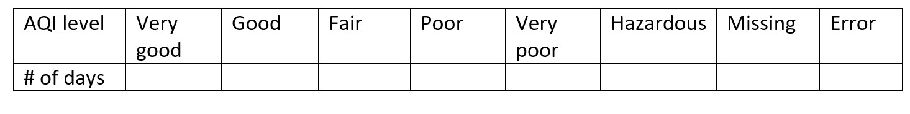
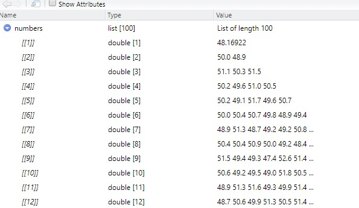

```{r setup, include=FALSE}
knitr::opts_chunk$set(echo = TRUE)
```

# Instructions:
Please follow the tutorial and answer all the questions for submission. You can put your answers as well as scripts as screenshot in a word document. 

## Session 1 conditional statements in R
There are several different conditional statements in R. For the first session in this lab, we will explore more about air quality. 


***Background***: Air pollution has a significant impact on human health,the economy and of course the urban environment. You might already hear about the Australia fires last year. We also call it 2019–20 Australian bushfire season, which is mainly in the southeast of the continent. I downloaded the air quality dataset from the website (https://www.dpie.nsw.gov.au/air-quality/search-for-and-download-air-quality-data) which were collected during Dec-2019 and Jan-2020 in Sydney central-east regions.  

Here is the detailed information for our dataset. 

1. Data category: AQI (Air Quality Index) which is measured hourly. 
2. Region: COOK AND PHILLIP in Sydney central-east
3. Dates period: Dec/1/2019-Jan/30/2020

```{r echo=F}
xfun::embed_file('Data/AQI_Sydney_Dec_Jan.csv')
```

Save this .csv file in locally under your data folder. 

Next, let's learn a little bit more about air quality index. You can find out about how current air quality might affect our health by looking at the colour indicator: the Air Quality Index (AQI), which is the 3rd column in our dataset.  

For more information about the AQI, please visit: https://www.dpie.nsw.gov.au/air-quality/understanding-air-quality-data

In summary, there is a AQI rating based on the AQI value. 


Very good:     AQI range: 0-33

Good :         AQI range: 34-66

Fair:          AQI range: 67-99

Poor :         AQI range: 100-149

Very poor:     AQI range: 150-199

Hazardous:     AQI range: >200

Here we will add a new column called "rating" in your dataset based on the AQI value for each record.For example, if AQI is 50, the rating should be "Good". 

1. Let's load the data first. Then we can preview the dataset. Use head() function to just read first 6 records. 
Execute the code chunk below. You should have only three columns: Data, time, and hourly measured QI for COOK AND PHILLIP.
```{r include=F}
library(tidyverse)
air_quality_AUS <- read_csv("data/AQI_Sydney_Dec_Jan.csv")
```


2. Add a new column called rating. 
We can directly call the new column using $ sign and assign NA to each cell. Execute the code chunk below. All the values in this column should be missing. We will assign values in the next step. We also use dim function to figure out how many rows and columns do we have. 

```{r }
air_quality_AUS$rating <- c("")
dim(air_quality_AUS)
```
Now your air_quality_AUS data should have 4 columns. Now let's work on the last column to assign values. 

3. Please use if else functions to assign new values. Again, here is the information you need. 

   rating:        AQI
1) Very good:     AQI range: 0-33
2) Good :         AQI range: 34-66
3) Fair:          AQI range: 67-99
4) Poor :         AQI range: 100-149
5) Very poor:     AQI range: 150-199
6) Hazardous:     AQI range: >200
7) Missing:       if AQI is missing for that record
8) Error:         All other possible values. e.g. negative values


The AQI information is the 3rd column in your dataset. Try to finish the code below. I alreay provide the basic structure of this loop. 

Hint: the dataset has over 1000 rows, and only 4 columns. Generate a for loop first to go over all the rows. Within the for loop, if the value in the 3rd column falls into any of the AQI ranges above, we assign a rating accordingly. Note you should have 'missing' and 'error' assigned in the rating column too. 

1) NA values: you will use is.na to find out missing values. If is.na(AQI)==TRUE, then assign 'Missing' to the 'rating' column (as action). 

2) Errors: at the end of this for loop, anything other than the 1-7 categories above, should be errors. So you will use ***else*** to assign these records as error. 

Please just fill up the loop to make it work.Free free to add another else if statement if needed. 

```{r }

for (i in 1:1464){
    if (is.na(air_quality_AUS[i,3]==TRUE)) {
         air_quality_AUS[i,4] <- "Missing"
    } else if (air_quality_AUS[i,3]<= 33) {
        air_quality_AUS[i,4] <- "Very Good"
    }else if (air_quality_AUS[i,3]<=66 & air_quality_AUS[i,3]>34){
        air_quality_AUS[i,4] <- "Good"
    } else if (air_quality_AUS[i,3]<99 & air_quality_AUS[i,3]>67){
        air_quality_AUS[i,4] <- "Fair"
    }  else if (air_quality_AUS[i,3]<=149 & air_quality_AUS[i,3]>100){
        air_quality_AUS[i,4] <- "Poor"
    }  else if (air_quality_AUS[i,3]<=199 & air_quality_AUS[i,3]>150) {
        air_quality_AUS[i,4] <- "Very Poor"
    }  else if (air_quality_AUS[i,3]>200){
        air_quality_AUS[i,4] <- "Hazardous"
    } 
    else 
        { air_quality_AUS[i,4] <- "ERROR"}
}


```

Now let's try to summary the column called 'rating' to figure out how many records are there for each category.You should have 8 categories.  
Execute the code chunk below. 
```{r}
table(air_quality_AUS$rating)
```


## Question 1 (15 points): 
1) Finish the loop above and provide your script as screenshot for submission. 
2) Fill the table below

 
 

## Question 2 (5 points): 
What is the average AQI for this dataset? (5 points). 
```{r}
mean(air_quality_AUS$`COOK AND PHILLIP AQI hourly AQI [index]`,na.rm=T)
```

## Question 3 (5 points):
Do you find any limitations for Q1? Anything else we need to specify when we assign values for each AQI?

Answer: The max value for AQI is abnormal (2140). We need to exclude extreme values too. Any other answers are acceptable as far as it makes sens. 

## Question 4 (10 points):
Use loops to generate a list, which contains 100 vectors, and the size of each vector is from 1-100. Each vector contains random numbers and follows normal distribution, with the mean of 50. 1) Provide your script as screenshot for submission.2) a preview of the list generated (see example below).Note since random numbers are generated, values must vary between each execution. 


Hint: to generate random numbers for normal distribution, use `rnorm` function. For example, the script below generate random 100 numbers with average of 20. 

Answer:
```{r eval=F}
rnorm(100, mean = 20)
```

```{r eval=F}
# Size of each vector inside the list
size <- 1:100
# Generate an empty list
numbers <- vector("list", length(size))
# Assign values to each vector in the list. 
for (i in seq_along(numbers)) {
  numbers[[i]] <- rnorm(i, mean = 50)
}
```

## Session 2 *apply functions


## Question 5 (5 points):
Can you use sapply/lapply/tapply to return average values for each column except species in iris_data?
Finish the code below and answer the question.
What is the average for 1) Sepal.Length; 2) Sepal.Width; 3) Petal.Length; 4) Petal.Width?

You need to provide your script as a screenshot for submission too. 
```{r}
sapply(iris[,1:4],mean)
```


## Question 6 (5 points): 
Load another dataset from R called airquality. This dataset includes daily air quality measurements in New York, May to September 1973. Let's load the dataset first. You can also use the help document to learn more about each column in this dataset. 

```{r eval=F}
data("airquality")
?airquality
```

Use a proper function (sapply/lapply/tapply), to answer the questions. What is the maximum temperature in each month (May to Sep)? You need to provide your script as a screenshot for submission too. 

```{r}
tapply(airquality$Temp,airquality$Month,max,na.rm=T)
```


## Question 7 (5 points): 
Use a proper function (sapply/lapply/tapply), to answer the questions.  
What is the value range for 1) Ozone; 2)Solar.R; 3) Wind; 4) Temp. You need to provide your script as a screenshot for submission too. Hint: to calculate range, you can use the `range` function. 
```{r}
sapply(airquality[,1:4],range,na.rm=T)
```


  
### This is the END of Lab 2. Please submit your word document to compass. 


